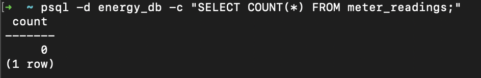
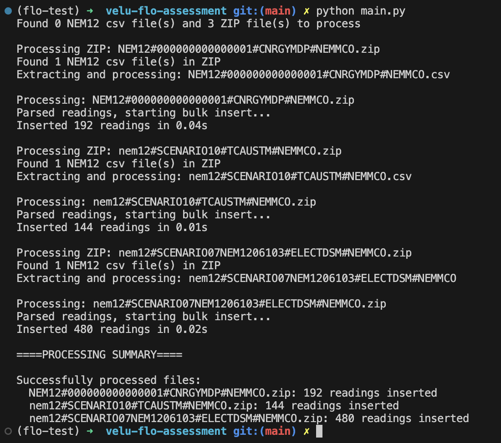

# Velu NEM12 processor assessment

This project processes NEM12 CSV files and stores the data in your local database.

## Setup Instructions

### 1. Install Dependencies
```bash
pip install -r requirements.txt
```

### 2. Database Configuration
- Ensure your local database is running
- Copy `.env.example` to `.env` and configure your database credentials:
```bash
cp .env.example .env
```
Edit the `.env` file with your specific database connection details.

### 3. Prepare Data Files
Place your NEM12 CSV files or ZIP archives in the `data/` folder:
```
data/
├── your-nem12-file.csv
├── another-nem12-file.zip
└── ...
```

### 4. Run the Application
```bash
python main.py
```

## What to Expect

### Database Changes
The application will create and populate the necessary database tables with your NEM12 data. Check the included screenshots of a query from my local postgres db to see the expected before/after database state.

Before:


After:


### Console Output
During execution, you'll see detailed logs showing the processing progress. Sample log output is included in the documentation for reference.

What your console output shold look like:


## Additional Documentation

See `WRITE_UP.md` for detailed answers to the assignment questions and technical implementation notes.